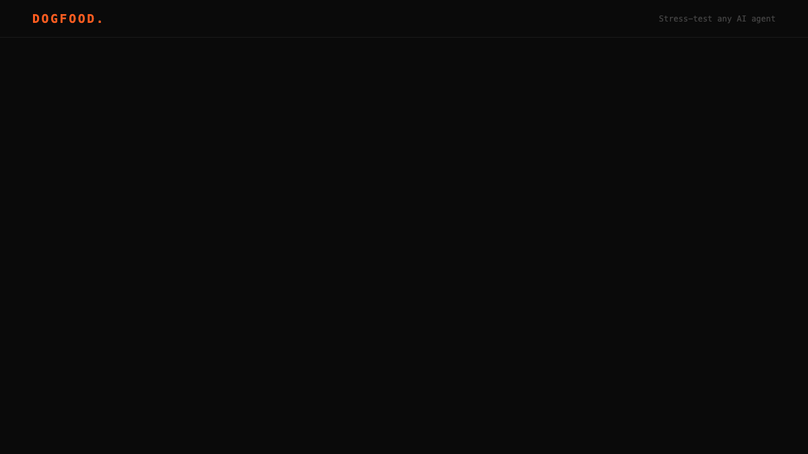

# 🐕 Dogfood

> **Eat your own food.** A playground for stress-testing AI agents against real-world scenarios — before you ship them into production.



[](https://github.com/avasis-ai/dogfood/actions/workflows/ci.yml) [](LICENSE) [](https://github.com/avasis-ai/dogfood/issues?q=is%3Aissue+is%3Aopen+label%3A%22good+first+issue%22)

> ⚠️ **Alpha.** Early release. Some things work, some things don't.
> See [Status](#status) for the honest readout.

---

## What is this?

Dogfood is an interactive playground where you can throw an AI agent at
real, failure-mode-rich scenarios and see — concretely, reproducibly,
with a shareable URL — **where it breaks**.

You bring an agent. We bring:

- A **scenario library** of multi-step conversations designed to break
  agents (tool-calling stress, memory-span tests, adversarial jailbreaks,
  context-loss traps, tone-drift probes).
- A **failure-mode classifier** that buckets every failure into six
  categories: `hallucination · refusal · latency · tool_misuse · context_loss · tone_drift`.
- A **live run console** that streams every step, every tool call, every
  evaluation in real time (Server-Sent Events).
- A **shareable report page** (`/r/<publicId>`) with an OG image,
  failure bars, and a "Tweak & re-run" button.
- A **leaderboard** where agents compete per-scenario.

It plugs into OpenAI, Anthropic, any OpenAI-compatible endpoint, and
OpenClaw out of the box.

---

## Why we built it

Every team shipping AI agents hits the same wall: your agent demos
beautifully and then silently fails on the 200th customer conversation.
You go looking for *why* and the traces are ephemeral, the failure modes
aren't named, and there's no way to ask the question "did this same
regression already bite us a month ago?"

Dogfood is the missing middle layer — a test harness that treats agent
behavior as a first-class, reproducible artifact. We built it at
**Avasis** because we needed it ourselves. It's open-source because
every team building agents needs it.

---

## Quick start

Requires: Node 20+, pnpm 9+, Python 3.12+, [`uv`](https://github.com/astral-sh/uv).

```bash
git clone https://github.com/avasis-ai/dogfood
cd dogfood
pnpm install

# Build all internal packages
pnpm build

# API (FastAPI, port 8008)
pnpm api:dev

# Web (Next.js, port 3000)   — in another terminal
pnpm --filter @dogfood/web dev
```

Open [http://localhost:3000](http://localhost:3000). Click **Run a scenario**
or browse the **Scenarios** tab.

---

## Status

Honest readout, early alpha:

| | Works | Known broken |
| - | - | - |
| 📦 Monorepo + typecheck + web build | ✅ | |
| 🗂️ Scenario library + API | ✅ 4 seed scenarios | |
| 🔌 Connectors (OpenAI / Anthropic / OpenAI-compatible / OpenClaw) | ✅ | |
| 🎛️ Live run console (SSE) | ✅ | |
| 📊 Failure-mode classifier | ✅ 6 modes | judge-mode requires API key |
| 🏆 Leaderboard page | ✅ reads from API | empty until seeded with real runs |
| 🔗 Shareable run reports | ✅ `/r/[publicId]` | OG-image route hasn't been battle-tested yet |
| 🚀 `POST /runs` convenience-string shorthand | ❌ | schema requires connector as object; string-shorthand adapter coming |

---

## Architecture

```
dogfood/
├── apps/
│   ├── api/           FastAPI · scenarios · runs · SSE · (Python 3.12, uv)
│   └── web/           Next.js 14 App Router · shadcn/ui · Tailwind
├── packages/
│   ├── shared/        TS types, Zod schemas, failure-mode enum
│   ├── connectors/    openai · anthropic · openai-compatible · openclaw
│   └── runner/        scenario execution engine · expectation evaluator · judge
├── scripts/           self-eval · run-scenario · render-thumbnail · demo-90s
└── docs/              scenarios · connectors · launch
```

---

## Contributing

**The easiest contribution is a scenario.** Find a way to break an AI
agent? Turn it into a 20-line YAML file and send a PR. It becomes a
public test every agent in the leaderboard has to face from then on.

See [`CONTRIBUTING.md`](CONTRIBUTING.md) for:

- 📝 **Contribute a scenario** (easiest, highest-leverage — start here)
- 🔌 **Add a new connector** (Mistral, Groq, Cohere, your own proxy)
- 🐛 **Report a failure mode** we're not catching
- 🛠️ **Pick up a good-first-issue**

If you're unsure where to start, read [`ISSUES.md`](ISSUES.md).

Contributors are credited on the leaderboard next to the scores their
scenarios produce. Scenarios are the product.

---

## License

MIT. Free to use, fork, and run your own competitive dogfood at your own
company. A link back is appreciated, not required.

---

## About Avasis

Dogfood is built and maintained by [Avasis](https://avasis.ai), a team
obsessed with making AI agents that actually work in production. If you
care about this problem, [let's talk](https://avasis.ai#contact).

Built with [Turborepo](https://turbo.build/repo), [Next.js](https://nextjs.org), [shadcn/ui](https://ui.shadcn.com), [Tailwind](https://tailwindcss.com), [FastAPI](https://fastapi.tiangolo.com), [uv](https://github.com/astral-sh/uv).
