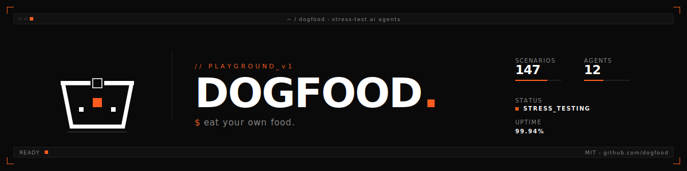
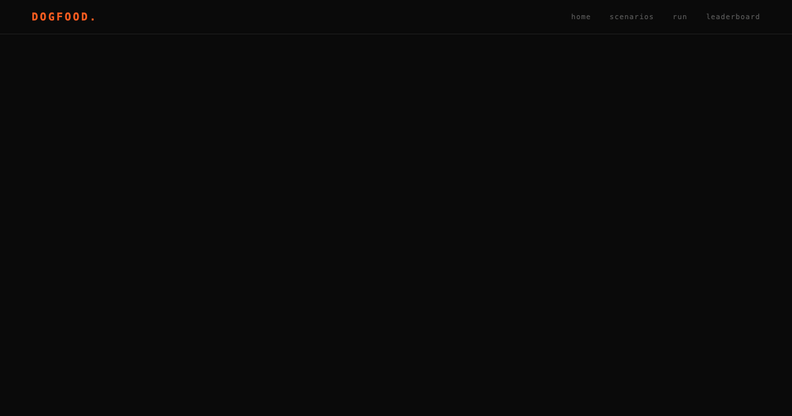

<p align="center">
  
</p>

<p align="center">
  <strong>Break your AI agents before your users do.</strong>
</p>

<p align="center">
  
</p>

<p align="center">
  <a href="https://github.com/avasis-ai/dogfood/actions/workflows/ci.yml"></a>
  
  <a href="https://github.com/avasis-ai/dogfood/issues?q=is%3Aissue+is%3Aopen+label%3A%22good+first+issue%22"></a>
</p>

---

## Why this exists

Your agent demos perfectly. Then it **hallucinates** on the 200th customer call. You check the traces — they're gone. The failure has no name. Nobody can tell you if this regression bit you last month.

**Every AI team lives this.** You ship agents and pray. Dogfood is the
prayer's opposite — a **reproducible, shareable stress test** that names
every failure mode and makes it a first-class artifact.

---

## What it does

You bring an agent. Dogfood brings the pain.

🧪 **Scenario library** — Multi-step conversations engineered to break
agents. Tool-calling stress, memory-span traps, adversarial jailbreaks,
context-loss probes, tone-drift detectors. [Write your own in 20 lines of
YAML.](docs/scenarios/_template.yaml)

🏷️ **Failure-mode classifier** — Every failure bucketed into six modes:

`hallucination · context_loss · tool_misuse · tone_drift · refusal · latency`

No more "it just stopped working." Now you know *exactly* what broke.

📡 **Live run console** — Streams every step, every tool call, every
evaluation in real time. Server-Sent Events, zero refresh.

📊 **Shareable reports** — Every run gets a public URL (`/r/<id>`) with
failure bars, OG images, and a "Tweak & re-run" button. **Send it to
your team. Send it to the model vendor.**

🏆 **Leaderboard** — Agents compete per-scenario. Scores persist.
Regressions surface instantly.

🔌 **Works with your stack** — OpenAI, Anthropic, any OpenAI-compatible
endpoint, and [OpenClaw](https://github.com/avasis-ai/openclaw) out of
the box.

---

## Quick start

**Requires:** Node 20+ · pnpm 9+ · Python 3.12+ · [uv](https://github.com/astral-sh/uv)

```bash
git clone https://github.com/avasis-ai/dogfood && cd dogfood
pnpm install && pnpm build
pnpm api:dev
```

In another tab: `pnpm --filter @dogfood/web dev`

Open **http://localhost:3000** → click **Run a scenario**. Done.

---

## Architecture

```
                         ┌─────────────────────┐
                         │     Next.js 14       │
                         │  App Router + SSE     │
                         │   shadcn · Tailwind   │
                         └─────────┬───────────-─┘
                                   │
                         ┌─────────▼─────────────┐
                         │      FastAPI           │
                         │   scenarios · runs     │
                         │   judge · classify     │
                         └─────────┬─────────────-┘
                                   │
              ┌────────────────────┼────────────────────┐
              │                    │                     │
     ┌────────▼────────┐ ┌────────▼────────┐  ┌────────▼────────┐
     │   OpenAI        │ │   Anthropic     │  │   OpenClaw /     │
     │   Connector     │ │   Connector     │  │   Compatible     │
     └─────────────────-┘ └─────────────────-┘  └─────────────────-┘

  dogfood/
  ├── apps/
  │   ├── api/            FastAPI · Python 3.12 · uv
  │   └── web/            Next.js 14 · shadcn/ui · Tailwind
  ├── packages/
  │   ├── shared/         TS types · Zod schemas · failure-mode enum
  │   ├── connectors/     openai · anthropic · openai-compatible · openclaw
  │   └── runner/         execution engine · expectation evaluator · judge
  ├── scripts/            self-eval · run-scenario · render-thumbnail
  └── docs/               scenarios · connectors · launch
```

---

## Contributing

**Scenarios are the product.** Found a way to break an AI agent? Turn it
into a YAML file and PR it. Your scenario becomes a public test that
every agent on the leaderboard has to face. [Here's the
template](docs/scenarios/_template.yaml) — 20 lines, zero boilerplate.

**Other ways in:**

- 🔌 Add a connector (Mistral, Groq, Cohere, your own proxy)
- 🐛 Report a failure mode we're not catching
- 🛠️ Pick up a [good first issue](https://github.com/avasis-ai/dogfood/issues?q=is%3Aissue+is%3Aopen+label%3A%22good+first+issue%22)

Contributors are credited on the leaderboard next to the scores their
scenarios produce. See [`CONTRIBUTING.md`](CONTRIBUTING.md) for the full
walkthrough.

---

## Status

Early alpha. Honest readout:

| | Status |
| - | - |
| Monorepo · typecheck · web build | ✅ Solid |
| Scenario library + API | ✅ 4 seed scenarios |
| Connectors (OpenAI / Anthropic / OpenAI-compatible / OpenClaw) | ✅ All wired |
| Live run console (SSE) | ✅ Streaming |
| Failure-mode classifier | ✅ 6 modes (judge-mode needs API key) |
| Leaderboard | ✅ Reads from API (empty until seeded) |
| Shareable run reports | ✅ `/r/[publicId]` live |
| `POST /runs` string shorthand | ❌ Needs object connector (fix in progress) |

---

## License

[MIT](LICENSE). Fork it, run your own internal dogfood, break your own
agents. A link back is appreciated.

---

## Built with

[Turborepo](https://turbo.build/repo) · [Next.js](https://nextjs.org) · [FastAPI](https://fastapi.tiangolo.com) · [shadcn/ui](https://ui.shadcn.com) · [Tailwind](https://tailwindcss.com) · [uv](https://github.com/astral-sh/uv)

<p align="center">
  <a href="https://avasis.ai"></a>
</p>

<p align="center">
  Built by <a href="https://avasis.ai">Avasis</a> — because we needed it ourselves.
</p>
